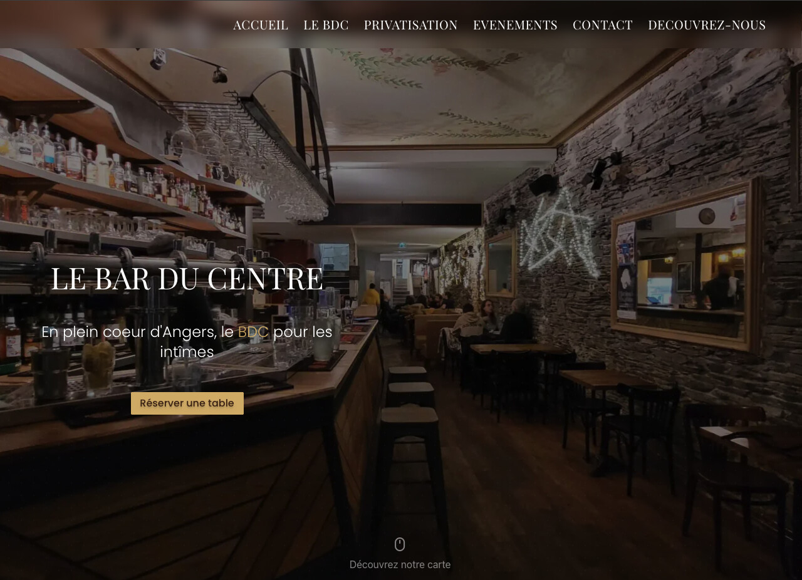
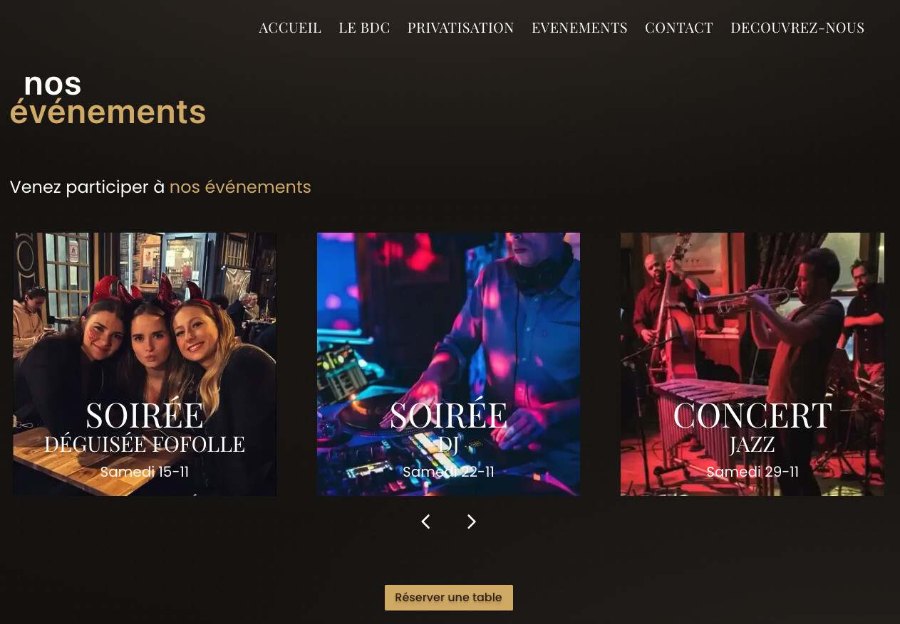
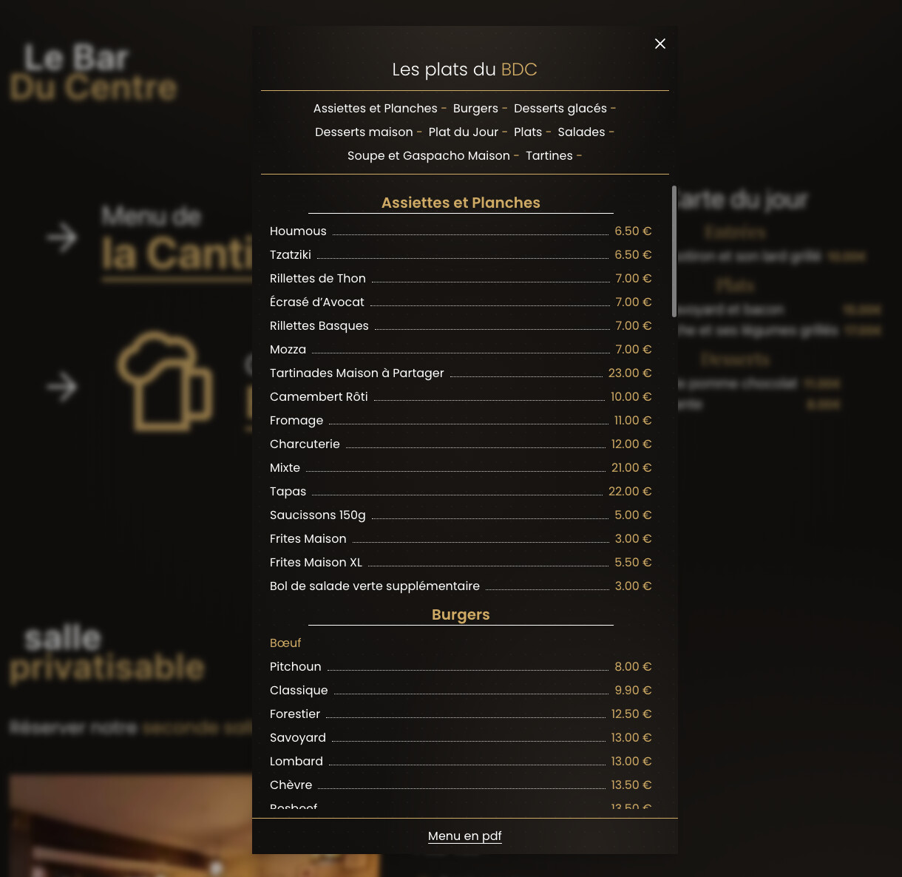
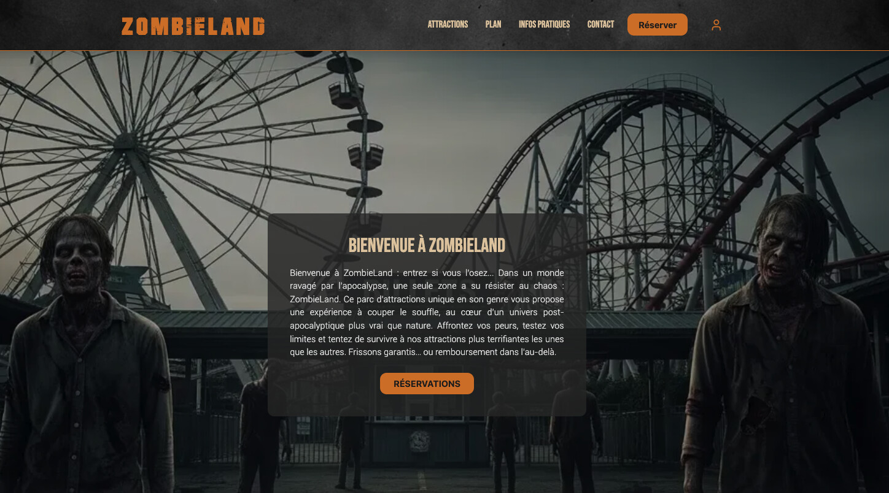
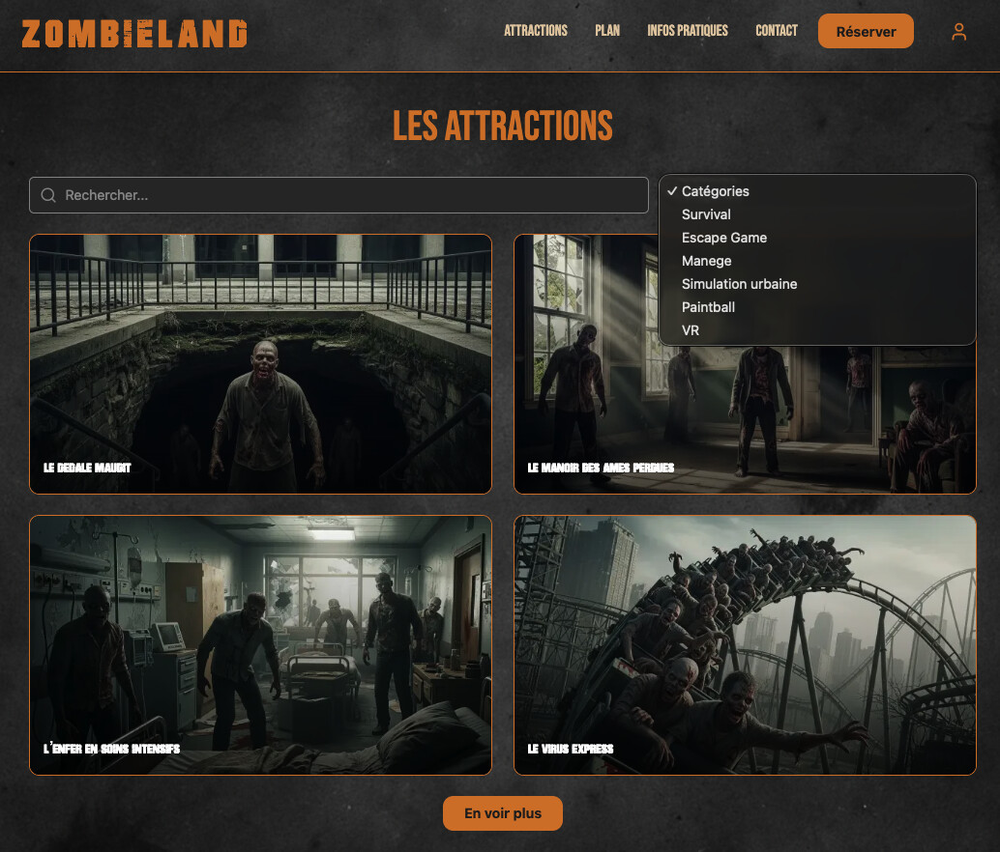
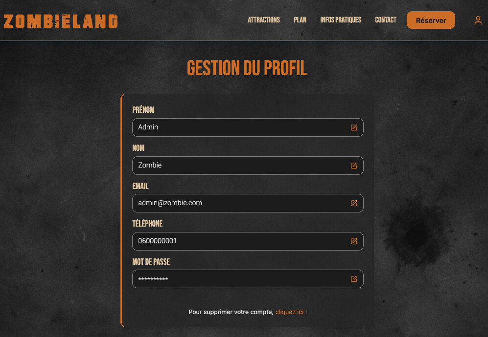

# 👋 Julien Desbard

**Développeur Fullstack** | React • Node.js • TypeScript  
📍 Lyon, France

Spécialisé dans la création de solutions web orientées business avec une forte attention portée à l'expérience utilisateur.

---

## 🛠️ Stack Technique

### Backend

### Frontend

### Validation & Sécurité

### Outils & DevOps

### Documentation & Monitoring

### Déploiement

### CMS & Auth

---

## 🚀 Projets Phares

### 🍺 Le Bar du Centre

**Site vitrine pour une brasserie historique d'Angers**

Site complet avec CMS headless, authentification et gestion de contenu dynamique.

**Stack :** Next.js • TypeScript • Strapi • NextAuth • Tailwind CSS  
**Déploiement :** Vercel (frontend) • Render (API & BDD)

[🔗 Voir le site](https://bar-du-centre.vercel.app) | 💻 Code source - disponible sur demande

📸 Captures d'écran

---

### 🧟 Zombieland - Projet collaboratif

**Site vitrine d'un parc d'attractions fictif** (projet de fin de bootcamp)

Développement en équipe avec gestion des rôles utilisateurs, paiement via stripe interface administrateur avec gestion du CRUD des attractions.

**Stack :** React • Node.js • Express • PostgreSQL  

[🔗 Voir le site](https://zombieland-front-vercel.vercel.app/) | [💻 Code source](https://github.com/Julien-Desbard/Zombieland)

📸 Captures d'écran

---

## 💼 Actuellement

🔭 Je développe **SmartCollect**, un système de gestion de factures intelligent et automatisé  
🌱 Architecture séparée • React + Vite • Node.js • PostgreSQL  
📍 **Recherche active** d'opportunités sur Lyon / Chambéry / Grenoble
---

## 📫 Contact

